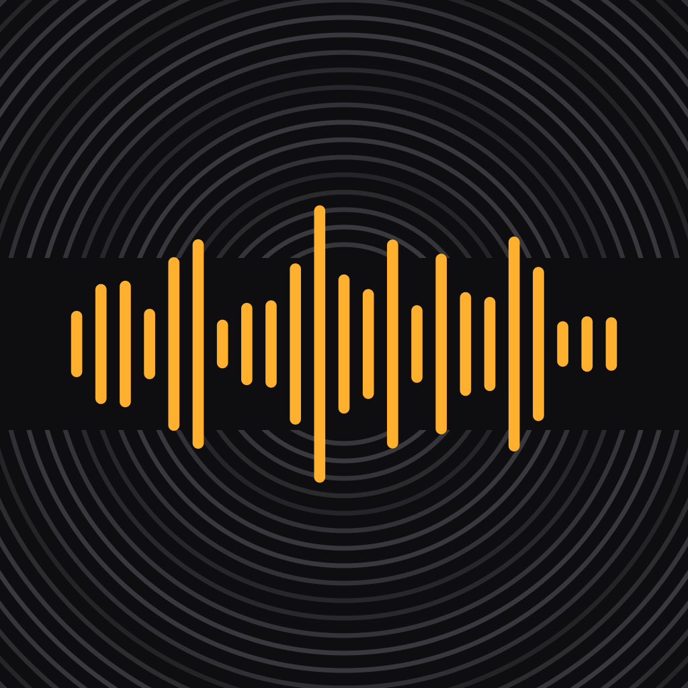

# scratch

*A scratch track is the rough vocal pass you record just to get the idea down. That's the whole app.*

**Get it down rough.**

Scratch is a voice note app for iPhone. Hit the big amber button, talk, and watch your words appear live as you speak — transcribed on-device, private, offline. Stop the take, fix the text if you want, then save it or share it (text, audio, or both) anywhere.



## Features

- **One-tap capture** — launch → recording is a single tap
- **Live transcription** while you speak (Apple Speech, on-device when available, with word timings)
- **Pause/resume** mid-take
- **Review before save** — edit the transcript, auto-generated titles from your first words
- **Word-synced playback** — the transcript highlights word-by-word as audio plays; tap any word to jump there
- **Library with full-text search** across all transcripts, waveform thumbnails per note
- **Share as text, audio, or both** via the standard iOS share sheet (Mail, Messages, AirDrop, …)
- Local SwiftData storage; schema is CloudKit-compatible for a future iCloud sync flip

## Building

Requirements: Xcode 26+, [XcodeGen](https://github.com/yonaskolb/XcodeGen) (`brew install xcodegen`).

```sh
xcodegen generate          # produces Scratch.xcodeproj (gitignored)
open Scratch.xcodeproj
```

Run tests:

```sh
xcodebuild -project Scratch.xcodeproj -scheme Scratch \
  -destination 'platform=iOS Simulator,name=iPhone 17 Pro' test
```

## Sideloading to your iPhone

1. `xcodegen generate && open Scratch.xcodeproj`
2. Plug in your iPhone (or pair over Wi-Fi). On the phone: Settings → Privacy & Security → Developer Mode → on (reboots once).
3. In Xcode, select the **Scratch** target → **Signing & Capabilities** → check *Automatically manage signing* → pick your **Personal Team** (sign in with your Apple ID under Xcode → Settings → Accounts if it's not listed).
4. If signing complains about the bundle id, change `PRODUCT_BUNDLE_IDENTIFIER` to anything unique.
5. Select your phone in the device picker and hit **Run** (⌘R).
6. First launch on a free personal team: on the phone, Settings → General → VPN & Device Management → trust your developer certificate.

Free-account caveats: the app expires after **7 days** (re-run from Xcode, ~30 seconds), and iCloud entitlements aren't available — which is why sync is deferred.

First recording: iOS will ask for microphone and speech-recognition permissions, and may download the on-device speech model.

## Architecture

- **SwiftUI, iOS 17+**, SwiftData persistence (`Note` model, all-default properties, CloudKit-ready)
- `RecorderEngine` — one `AVAudioEngine` mic tap feeding an `.m4a` writer and `SFSpeechRecognizer` simultaneously; finalized utterances accumulate so silence boundaries don't drop text
- `PlaybackEngine` — `AVAudioPlayer` + 20 Hz clock for transcript sync and scrubbing
- `TranscriptSync` — falls back to proportional word spread when the recognizer's timings are unusable (all-zero timestamps, edited text)
- Icon is generated: `swift Scripts/render_icon.swift <out.png>`

### Debug harness

Launch-environment hooks (DEBUG builds only) drive the app headlessly for testing:

| Variable | Effect |
|---|---|
| `SCRATCH_SEED=1` | seed three sample notes into an empty library |
| `SCRATCH_SCREEN=recording` | open a seeded recording screen (no mic/permissions) |
| `SCRATCH_AUTORECORD=1` | start a real recording at launch |
| `SCRATCH_AUTOSTOP=<sec>` | stop the take after N seconds |
| `SCRATCH_AUTOSAVE=1` | save from the review sheet automatically |
